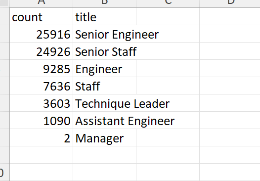
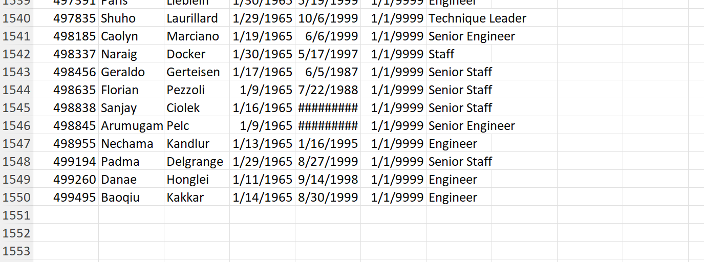

# Pewlett-Hackard-Analysis

## Overview

The purpose of this analysis is to use information gathered from the employee database to gain insights about employees currently eligible for retirement and employees eligible for a mentorship program.

## Results

- As shown above, well over 50,000 employees are eligible for retirement.
- Most employees eligible for retirement are Senior Engineer or Senior Staff and only 2 Managers are eligible for retirement. Hence, almost all Managers are eligible for retirement.
- Most employees who are eligible for the mentorship program can do the jobs of retiring employees with or without additional training.
- Only 1,550 employees are currently eligible for the mentorship program.

## Summary

About 72,000 new roles will need to be filled as the "silver tsunami" begins to make an impact. There are more than enough retirement-ready employees to mentor the next generation of Pewlett-Hackard employees, but the scope of the current mentorship program is nowhere near enough to meet demand. I recommend expanding the mentorship program to include employees born between 1960 and 1975 as a starting point. One table that may provide insight into the upcoming "silver tsunami" is a table of low-salary employees eligible for retirement, since employees with lower salaries might have a greater incentive to retire and less incentive to mentor other employees. Additionally, a table displaying the number of years an employee has worked for the company might help quantify retirement risk, since people who have worked at the company for longer might have more motivation to stay and mentor younger employees.
